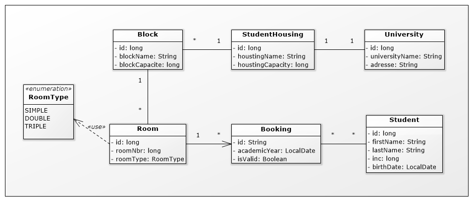

# Spring Boot - Academic project  
For 4th year classes (engineering degree): ESPRIT engineering school

## Class Diagram



## Requirements

For building and running the application you need:

- [JDK 17](https://download.oracle.com/java/17/latest/jdk-17_windows-x64_bin.exe)

## Running the application locally

There are several ways to run a Spring Boot application on your local machine.
One way is to execute the `main` method in the `tn.esprit.studenthousing.StudentHousingApplication` class from your IDE.

Alternatively you can use the [Spring Boot Maven Wrapper plugin](https://maven.apache.org/wrapper/) like so:

```shell
./mvnw spring-boot:run
```
## Browser URL
Open your browser at the following URL for Swagger UI (giving REST interface details):

http://localhost:9090/swagger-ui/index.html 

